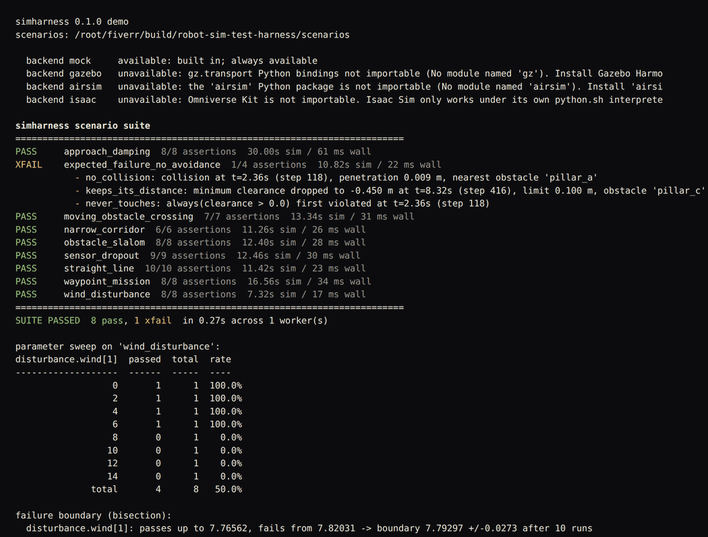
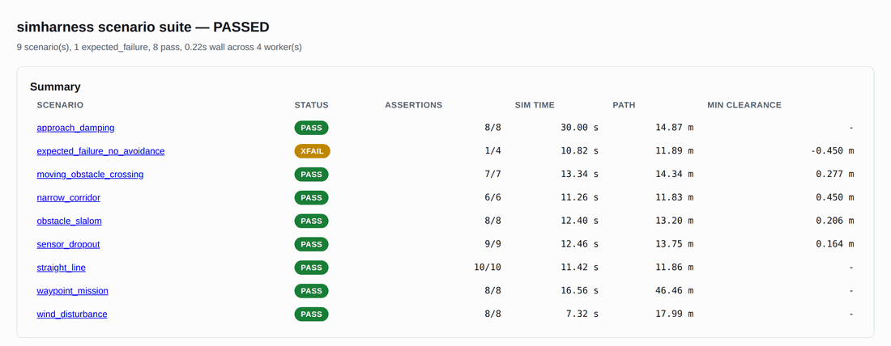
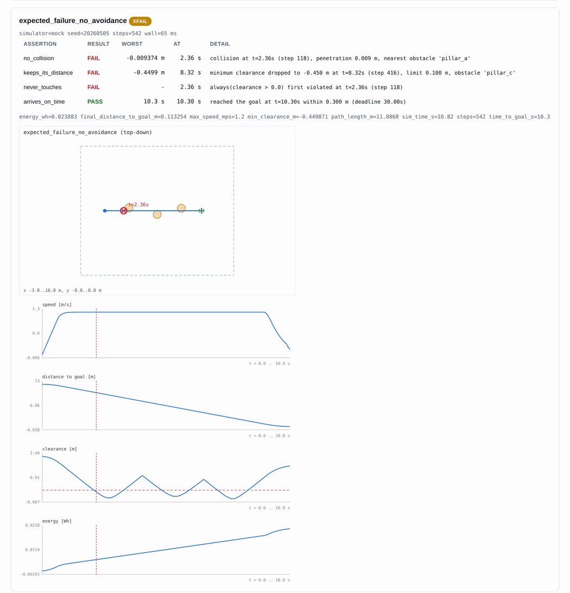
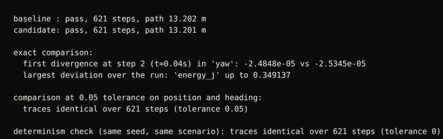

# robot-sim-test-harness

Scenario-driven regression testing for robot *behaviour* in simulation: write a
scenario in YAML, assert what the robot must and must not do, and fail the
build when a change breaks it.


## The problem

Launching a simulator is the easy part. Every tutorial ends there: a robot
model, a world file, a screenshot, done.

What almost nobody has is the next part — **automated regression testing of
robot behaviour**. So the following keeps happening:

- Someone retunes a gain. Three weeks later the robot clips a doorframe. The
  commit that broke it is long buried, because nothing was watching clearance.
- The obstacle test "passes" because a human watched it once, on one seed, in
  one wind condition. Nobody knows what happens at 4 m/s of crosswind because
  nobody ever tried 4 m/s of crosswind.
- A test fails intermittently, gets muted, and stops being a test.
- The path got 8% longer and the settling time crept from 5.2 s to 6.1 s. No
  human notices that. It compounds for six months and then it is a field
  problem.
- The suite is green, and it is green because the assertions stopped firing
  three refactors ago, not because the robot is fine.
- Everything is written against Gazebo's API, so it cannot run in CI without a
  GPU, and it cannot be pointed at AirSim without a rewrite.

This repository is the missing half: a declarative scenario format, behavioural
and **temporal** assertions over recorded runs, deterministic seeded execution,
parameter sweeps that find the failure boundary, trace diffing that tells you
the exact timestep two versions diverged, and reports that drop straight into
CI. It ships with a real headless simulator so the whole thing runs offline,
and puts Gazebo, AirSim and Isaac Sim behind one six-method interface.

## Screenshots


`./tools/simharness --demo` running the nine bundled scenarios headless, then sweeping crosswind from 0 to 14 m/s and bisecting to the exact speed the controller stops holding.


The self-contained HTML report written by `simharness suite scenarios/ --html`, run against the nine scenarios in `scenarios/`.


The same report's card for `expected_failure_no_avoidance`: three failed assertions with the exact timestep and value, a top-down trajectory with the collision marked, and speed, distance, clearance and energy traces. The SVG is generated by `simharness/report.py` with no plotting library.


`examples/05_trace_diff_regression.py` comparing a baseline run of `obstacle_slalom` against the same scenario with the angular gain nudged 2 percent. It names the first timestep the two runs disagree, and confirms a repeat run is byte-identical.

## What you get

| | |
|---|---|
| `simharness/scenario.py` | Declarative YAML scenarios: world, spawn, goal, static and moving obstacles, sensor noise/bias/dropout, wind and gusts, time limit, assertions. Validation errors name the offending key (`obstacles[2].radius`) with a spelling suggestion. `extends:` deep-merges a base scenario so a family of tests varies one field. |
| `simharness/simulators/` | Six-method `Simulator` ABC. `mock.py` is a **real** headless simulator: differential-drive and quadrotor point-mass kinematics, exact first-order actuator lag, relative-airspeed wind drag, gusts, turbulence, moving-obstacle collision detection, and a sensor model with noise, bias, latency and dropout. `gazebo.py`, `airsim.py` and `isaac.py` are guarded adapters that document their exact connection mechanism. A registry logs *why* it picked a backend. |
| `simharness/assertions.py` | Reached-goal, collision, minimum clearance, geofence, velocity/acceleration/jerk limits, path-length ratio, settling time, overshoot, heading error, oscillation frequency, energy budget — **plus temporal operators**: `always`, `eventually`, `eventually always`, `A until B`, with the finite-trace semantics written down. Every result carries the worst-case value, the timestamp, and a sentence. |
| `simharness/runner.py` | Deterministic seeding, fixed-step execution, wall-clock timeout, trace recording, crash isolation, and a worker pool. **The same seed produces a byte-identical trace**, and there is a test for that. |
| `simharness/sweep.py` | Grid sweeps and Monte Carlo over initial conditions, noise seeds, wind and controller gains, with a pass-rate table — and **failure-boundary bisection**, which turns "it worked once" into "it holds to 7.79 m/s of crosswind and fails past 7.82". |
| `simharness/trace.py` | The run record: 21 fields per timestep plus events. JSON and CSV. Trace diffing that reports the **first divergent timestep**, the field, and both values. |
| `simharness/report.py` | Coloured terminal summary, JUnit XML, JSON, and a self-contained HTML report with hand-generated inline SVG — trajectory top-down with obstacles and the failure point marked, plus per-signal time series. No plotting library, no CDN, one file. |
| `simharness/ci.py` | Baseline comparison with per-metric tolerances. Green-to-red fails the build; a missing scenario fails the build; metric drift is advisory unless you ask for `--strict-metrics`. |
| `tools/simharness` | CLI: `run`, `suite`, `sweep`, `replay`, `diff`, `report`, `ci`, `simulators`, `--demo`. |
| `scenarios/` | 9 scenarios: straight-line, slalom, narrow corridor, moving-obstacle crossing, wind disturbance, waypoint mission on a tight budget, sensor-dropout recovery, approach damping — and one that is **expected to fail**. |
| `tests/` | 13 files, 299 test cases, 681 assertions. Offline, deterministic, no simulator required. |

**The whole harness runs with PyYAML as its only runtime dependency.** No numpy,
no matplotlib, no pandas. That is what makes it install and run in a bare CI
container in seconds.

## Quickstart

```bash
git clone https://github.com/Pratyush150/robot-sim-test-harness
cd robot-sim-test-harness
pip install pyyaml

./tools/simharness --demo
```

That runs the whole scenario suite headless, then a parameter sweep and a
failure-boundary bisection. No simulator install, no GPU, no network, about a
second. Then:

```bash
./tools/simharness suite scenarios/ --workers 4 \
    --junit reports/junit.xml --html reports/report.html
python3 -m pytest -q
```

`pip install -e .` also puts `simharness` on your PATH.

## How it works

```
   scenarios/*.yaml
         |
         |  extends: deep-merge, then schema validation
         |  (errors name the key: "obstacles[2].radius: must be > 0")
         v
   +-----------------+        +----------------------+
   |    Scenario     |------->|      Controller      |  sees only the ESTIMATE,
   |  (frozen, typed)|        | goto-goal / waypoint |  dead-reckons through
   +-----------------+        +----------------------+  sensor dropouts
         |                              |
         | reset(scenario)              | send_command(Command)
         v                              v
   +-----------------------------------------------+
   |                Simulator (ABC)                 |
   |   reset  step  get_state  send_command         |
   |   spawn  close                                 |
   +-----------------------------------------------+
     |            |            |             |
   mock       gazebo        airsim        isaac
  (built in) (gz-transport) (msgpack-RPC) (Kit in-process)
     |
     |  fixed dt, seeded RNG, ground truth + corrupted estimate
     v
   +-----------------+
   |      Trace      |  21 fields/step, events, quantised to 9 dp
   +-----------------+
         |
         +------------------+------------------+------------------+
         v                  v                  v                  v
   +-----------+     +-------------+    +-------------+    +-------------+
   | assertions|     |    sweep    |    |    diff     |    |   report    |
   | scalar +  |     | grid / MC / |    | first       |    | terminal    |
   | temporal  |     | bisection   |    | divergent   |    | JUnit XML   |
   +-----------+     +-------------+    | step        |    | HTML + SVG  |
         |                              +-------------+    | JSON        |
         v                                                 +-------------+
   +-----------+                                                 |
   | RunResult |  pass / fail / xfail / xpass / error / timeout   v
   +-----------+ -----------------------------------------> ci.py baseline
                                                             compare -> exit code
```

**The data flow, in words.**

1. `load_scenario()` resolves `extends:` by deep-merging the base document,
   then validates the result. A bad key raises `ScenarioError` naming the full
   path — `robot.max_sped: unknown key; did you mean 'max_speed'?` — not a
   `KeyError` three frames down.
2. The runner computes the step count up front from `time_limit / dt` and
   seeds every stochastic source from `sim.seed` through named sub-streams.
   Nothing reads the wall clock.
3. Each step: the controller sees the **estimate** (noisy, biased, possibly
   frozen mid-dropout) and returns a `Command`. The simulator integrates ground
   truth, applies wind, checks collisions against static and moving obstacles,
   and returns both truth and estimate. Both are recorded.
4. Floats are quantised to 9 decimal places on record. That is what makes
   "same seed, byte-identical trace" a property you can assert on instead of
   an epsilon dance.
5. Assertions run over the finished trace via a derived signal table
   (`speed`, `accel`, `jerk`, `clearance`, `distance_to_goal`,
   `estimate_error`, `geofence_margin`, …). Temporal operators are pure
   functions over boolean series, which is why they can be unit-tested on
   hand-written traces.
6. The result is classified: `pass`, `fail`, `expected_failure`,
   `unexpected_pass`, `error` or `timeout`. Only the first two of those are
   green — an `expect_failure` scenario that starts passing **fails the build**.
7. Reports and the baseline comparison consume `RunResult` objects. Nothing
   downstream knows which simulator produced the trace.

## Worked example

The full suite, run on the shipped scenarios. This output is pasted from an
actual run:

```
$ ./tools/simharness suite scenarios/ --workers 4
simharness scenario suite
========================================================================
PASS     approach_damping  8/8 assertions  30.00s sim / 110 ms wall
XFAIL    expected_failure_no_avoidance  1/4 assertions  10.82s sim / 50 ms wall
           - no_collision: collision at t=2.36s (step 118), penetration 0.009 m, nearest obstacle 'pillar_a'
           - keeps_its_distance: minimum clearance dropped to -0.450 m at t=8.32s (step 416), limit 0.100 m, obstacle 'pillar_c'
           - never_touches: always(clearance > 0.0) first violated at t=2.36s (step 118)
PASS     moving_obstacle_crossing  7/7 assertions  13.34s sim / 65 ms wall
PASS     narrow_corridor  6/6 assertions  11.26s sim / 54 ms wall
PASS     obstacle_slalom  8/8 assertions  12.40s sim / 56 ms wall
PASS     sensor_dropout  9/9 assertions  12.46s sim / 55 ms wall
PASS     straight_line  10/10 assertions  11.42s sim / 34 ms wall
PASS     waypoint_mission  8/8 assertions  16.56s sim / 59 ms wall
PASS     wind_disturbance  8/8 assertions  7.32s sim / 29 ms wall
========================================================================
SUITE PASSED  8 pass, 1 xfail  in 0.18s across 4 worker(s)
```

Note the `XFAIL`. `expected_failure_no_avoidance.yaml` is the same slalom with
the avoidance term switched off, and it is **supposed** to collide. The suite is
green only while it keeps failing. If a refactor makes collision detection stop
firing, every other scenario stays green and this one flips to `XPASS`, which
fails the build. A regression suite that can only ever go green is not
measuring anything.

Any single scenario, with the passing assertions shown:

```
$ ./tools/simharness run scenarios/sensor_dropout.yaml -v
simharness scenario suite
========================================================================
PASS     sensor_dropout  9/9 assertions  12.46s sim / 33 ms wall
           + arrives_despite_dropouts: reached the goal at t=11.94s within 0.450 m (deadline 32.00s)
           + no_collision: no collision; closest approach was 0.164 m at t=7.28s
           + keeps_clearance_while_blind: minimum clearance held 0.164 m at t=7.28s (step 364), limit 0.080 m, obstacle 'drum'
           + stays_in_world: stayed inside the fence, closest approach to the boundary 0.500 m at t=0.00s
           + dropouts_actually_happened: eventually(sensor_valid <= 0.0) satisfied at t=0.46s (step 23)
           + estimate_error_stays_bounded: always(estimate_error <= 1.25) held for all 624 steps
           + estimate_snaps_back: eventually_always(estimate_error <= 0.2) stabilised at t=8.44s (step 422), deadline 32.00s
           + gets_there: eventually(distance_to_goal <= 0.45) satisfied at t=11.94s (step 597) within 32.00s
           + recovers_and_stays: eventually_always(distance_to_goal <= 0.6) stabilised at t=11.70s (step 585), deadline 32.00s
           energy_wh=0.050561  final_distance_to_goal_m=0.240969  max_speed_mps=1.2  min_clearance_m=0.16391  path_length_m=13.7454  sim_time_s=12.46  steps=624  time_to_goal_s=11.94
========================================================================
SUITE PASSED  1 pass  in 0.03s across 1 worker(s)
```

### Finding the envelope, not just a data point

One passing run tells you nothing about the envelope. A sweep does. Real
output:

```
$ ./tools/simharness sweep scenarios/wind_disturbance.yaml \
      --param 'disturbance.wind[1]=0,2,4,6,7,8,9,10,12' --workers 4
sweep 'wind_disturbance' (grid): 5/9 passed (55.6%) in 0.30s

disturbance.wind[1]  passed  total  rate
-------------------  ------  -----  ----
                  0       1      1  100.0%
                  2       1      1  100.0%
                  4       1      1  100.0%
                  6       1      1  100.0%
                  7       1      1  100.0%
                  8       0      1    0.0%
                  9       0      1    0.0%
                 10       0      1    0.0%
                 12       0      1    0.0%
              total       5      9   55.6%

first 4 failing point(s):
  disturbance.wind[1]=8  ->  arrives_on_time
  disturbance.wind[1]=9  ->  arrives_on_time, accel_limit
  disturbance.wind[1]=10  ->  arrives_on_time, accel_limit
  disturbance.wind[1]=12  ->  arrives_on_time, accel_limit, converges_and_stays
```

The grid brackets the boundary. Bisection pins it, in ten runs:

```
$ ./tools/simharness sweep scenarios/wind_disturbance.yaml \
      --boundary 'disturbance.wind[1]' --low 0 --high 14 --tolerance 0.1
disturbance.wind[1]: passes up to 7.76562, fails from 7.82031 -> boundary 7.79297 +/-0.0273 after 10 runs
  disturbance.wind[1]=0            pass
  disturbance.wind[1]=14           fail
  disturbance.wind[1]=7            pass
  disturbance.wind[1]=10.5         fail
  disturbance.wind[1]=8.75         fail
  disturbance.wind[1]=7.875        fail
  disturbance.wind[1]=7.4375       pass
  disturbance.wind[1]=7.65625      pass
  disturbance.wind[1]=7.76562      pass
  disturbance.wind[1]=7.82031      fail
```

Those numbers describe *this* controller against *this* vehicle model in *this*
simulator — that is the only claim being made. But it is a number, it is
reproducible, and it goes in a design review. "It seemed fine in the wind" does
not.

### Localising a regression

```
$ ./tools/simharness run scenarios/obstacle_slalom.yaml --trace-dir a
$ ./tools/simharness run scenarios/obstacle_slalom.yaml --trace-dir b \
      --set controller.kp_angular=3.06          # a 2% gain change
$ ./tools/simharness diff a/obstacle_slalom.trace.json b/obstacle_slalom.trace.json
first divergence at step 2 (t=0.04s) in 'yaw': -2.4848e-05 vs -2.5345e-05
  samples: 621 vs 621, compared 621 steps
  largest deviation: 'energy_j' up to 0.349137481
    energy_j       0.349137481
    cmd_yaw_rate   0.038841551
    yaw_rate       0.034981244
    vy             0.013846269
    est_yaw        0.011620601
    yaw            0.0116206
    y              0.005143799
    est_y          0.005143799
```

At zero tolerance a 2% gain change shows up on step 2. Ask a more useful
question and you get a more useful answer:

```
$ ./tools/simharness diff a/obstacle_slalom.trace.json b/obstacle_slalom.trace.json \
      --tolerance 0.05 --fields x,y,yaw
traces identical over 621 steps (tolerance 0.05)
```

The robot went to the same places. Nothing to investigate.

## A scenario

The format, in full, from `scenarios/moving_obstacle_crossing.yaml`:

```yaml
extends: _base_ground.yaml
name: moving_obstacle_crossing
description: >
  A second vehicle crosses the path from the right at 0.55 m/s, timed to arrive
  at the crossing point at roughly the same moment as the robot.
tags: [avoidance, ground, dynamic]

goal: {x: 12.0, y: 0.0, tolerance: 0.3, within: 32.0}

obstacles:
  - id: crosser
    shape: circle
    x: 6.0
    y: -3.2
    radius: 0.45
    motion: {type: linear, vy: 0.55}
  - {id: parked, shape: box, x: 9.0, y: 1.6, size_x: 1.2, size_y: 1.2}

sim: {time_limit: 40.0}

assertions:
  - {type: reached_goal, name: arrives_on_time}
  - {type: no_collision}
  - {type: min_clearance, name: yields_to_the_crosser, threshold: 0.08}
  - {type: geofence, name: stays_in_world}
  - {type: max_velocity, name: speed_limit, limit: 1.25}
  - {type: never, name: never_penetrates,
     predicate: {signal: clearance, op: "<", value: 0.0}}
  - {type: until, name: safe_until_arrival, within: 32.0,
     condition: {signal: clearance, op: ">=", value: 0.08},
     release: {signal: distance_to_goal, op: "<=", value: 0.3}}
```

Everything else — world bounds, vehicle limits, actuator lag, sensor noise,
controller gains, step size, seed — is inherited from `_base_ground.yaml`.
Full reference in [`docs/ASSERTIONS.md`](docs/ASSERTIONS.md).

## What this handles that a tutorial does not

**Determinism is a tested property, not a hope.** Every random draw comes from
`sim.seed` through *named sub-streams*, so adding a turbulence term does not
shift the sensor-noise sequence and move the whole trace. The step count is
computed up front from `time_limit / dt` — nothing reads the wall clock, so a
loaded build agent produces the same trace as an idle laptop. Recorded floats
are quantised, so the test compares JSON strings. `tests/test_determinism.py`
runs every shipped scenario twice and demands byte-identical output, checks
that a *different* seed does differ, and checks that a 4-worker parallel run
matches a serial one exactly.

**The actuator model does not explode when you change the step rate.** Lag is
integrated with the exact discrete solution, `alpha = 1 - exp(-dt/tau)`, not
explicit Euler's `dt/tau`. With Euler, a `dt` anywhere near `tau` makes the
model ring or diverge — so lowering your step rate silently changes your
physics, and your baseline with it. There is a test that drives `dt` to 100×
`tau` and requires a monotone, bounded response.

**Moving obstacles are a closed-form function of `t`.** Not integrated. Halving
`dt` puts the obstacles in the same places at the same times instead of
accumulating a different integration error, so refining the step does not
quietly change what the scenario is testing.

**The controller never sees ground truth.** It gets the estimate, corrupted by
noise, bias, latency and dropout, and dead-reckons on its own commanded
velocity when the fix goes away. That is why `sensor_dropout.yaml` is a real
test: the `estimate_error` signal reaches 1.04 m mid-dropout and the assertions
bound both that excursion and the recovery.

**Expected failures are first-class.** A scenario marked `expect_failure: true`
that fails is green and reported as `XFAIL`. The same scenario *passing* is
`XPASS` and fails the build. In JUnit XML the failing assertions become
`<skipped>` so CI does not go red, and the `XPASS` becomes a real `<failure>`
on a synthetic `expected_failure_guard` testcase. This is how you notice that
your assertions have stopped firing.

**Crash isolation, including the worker pool.** A scenario that raises becomes
a `RunResult` with `status="error"` and the traceback attached; the suite keeps
going. If the process pool itself dies, the remaining scenarios are re-run
serially rather than lost. Results always come back in input order, so a
parallel run and a serial run produce identical reports.

**Failure messages you can act on.** `min clearance dropped to -0.450 m at
t=8.32s (step 416), limit 0.100 m, obstacle 'pillar_c'` names the value, the
time, the step and the culprit. Compare with `assert False`.

**Temporal operators with the finite-trace semantics written down.**
`eventually always` on a finite trace degenerates to "true at the last step" —
so the implementation also reports the *stabilisation time* and accepts
`settle_by` to bound it. `until` is **strong** until: a release condition that
never occurs is a failure, not a vacuous pass. Vacuous truth is reported rather
than hidden. Each operator is a pure function over a boolean series, unit
tested on hand-written sequences.

**Backends that document how they actually connect.** Gazebo Sim has to be
started **paused** and stepped with `WorldControl.multi_step`, or you are
racing it. AirSim needs `simPause` + `simContinueForTime`; `ClockSpeed` is
wall-clock rescaling, not determinism. Isaac Sim loads Kit into *your* process,
so `SimulationApp` must be constructed before any `omni.*` import and the whole
thing only runs under its own `python.sh`. All three adapters reject a `dt`
that is not an integer multiple of the engine's physics step rather than
letting it quantise your timestamps behind your back.

**Reports with no supply chain.** The HTML report is one file: hand-written
inline SVG for the trajectory (obstacles, swept paths of moving obstacles,
goal tolerance circle, failure point marked with its timestamp) and the
time-series plots. No matplotlib in the CI container, no CDN, opens offline
from a build artifact.

## Limitations

Stated plainly, because this section is worth more than a feature list.

- **`MockSimulator` is kinematic, not aerodynamic.** Point-mass quadrotor and
  unicycle ground robot. No rotor wake, no ground effect, no wheel slip model,
  no contact solver, no attitude dynamics. It is built to exercise the harness
  and to test *trajectory-level* behaviour. It will not tell you whether your
  airframe is controllable.
- **The Gazebo, AirSim and Isaac adapters are wiring, not a tested code path.**
  Nothing in `tests/` exercises them, because none of those simulators are
  installed in CI. They document the exact connection mechanism and implement
  the interface; expect to spend an afternoon on your specific model and topic
  names. `GazeboSimulator._refresh_pose()` in particular is deliberately left
  as an explicit hook, because the right pose source depends on whether you are
  on gz-transport or ROS 2.
- **The shipped controllers have a perfect obstacle map.** This harness tests
  trajectory behaviour, not SLAM or perception. If you want to test perception,
  bring your own controller — the interface is three methods.
- **The sensor model is Gaussian.** Real noise is structured, correlated and
  occasionally malicious: multipath, magnetometer disturbance from your own
  power wiring, a LiDAR that returns nothing off wet asphalt. `dropout` and
  `bias` cover the common structured cases; they do not cover all of them.
- **The energy model is a simple mechanical estimate**
  (`idle + m|a||v| + m·drag·|v|²`). It is useful for *relative* comparison
  between runs. It is not a battery model, and the absolute watt-hours should
  not be quoted anywhere.
- **`no_oscillation` estimates frequency from zero crossings of a linearly
  detrended signal.** Cheap, dependency-free, and adequate for "is it hunting".
  It is not spectral analysis, and it will not separate two superimposed
  frequencies.
- **Failure-boundary bisection assumes monotonicity.** If the pass/fail
  relationship is not monotone in the parameter, bisection finds *a* crossing,
  not the lowest one. Endpoints are always probed first, and a missing bracket
  is reported (`passes_everywhere` / `fails_everywhere`) rather than papered
  over — but a non-monotone parameter wants a grid sweep, not bisection.
- **Determinism guarantees stop at the backend boundary.** Traces are
  byte-identical for the mock simulator on a given interpreter. DART and PhysX
  are deterministic for a fixed step, scene and build, but *not* across engine
  versions or GPU drivers. Pin your simulator version, and use
  `diff --tolerance` for contact-rich scenarios.
- **A green suite is a regression net, not a certificate.** It means nothing you
  changed this week broke something that used to work. It does not mean the
  robot will fly. See [`docs/SIM_TESTING.md`](docs/SIM_TESTING.md) for what
  transfers to hardware and what does not.

## Layout

```
src/simharness/
  scenario.py       YAML format, validation with key paths, extends/overlays
  simulators/
    base.py         the six-method Simulator ABC, Command, SimState
    mock.py         real headless kinematics, wind, collisions, sensor model
    gazebo.py       gz-transport adapter, guarded import
    airsim.py       msgpack-RPC adapter, guarded import
    isaac.py        Omniverse Kit adapter, guarded import
    __init__.py     registry: selects a backend and logs why
  controllers.py    go-to-goal and waypoint controllers under test
  assertions.py     scalar + temporal assertions, signal table, registry
  runner.py         fixed-step execution, seeding, crash isolation, worker pool
  sweep.py          grid, Monte Carlo, failure-boundary bisection
  trace.py          run record, JSON/CSV, trace diffing
  report.py         terminal, JUnit XML, JSON, HTML with hand-written SVG
  ci.py             baselines, per-metric tolerances, build verdict
  cli.py            argparse CLI
  geometry.py       point-in-polygon, signed distances, angle wrapping
scenarios/          9 scenarios + 2 base fragments
tests/              13 files, 299 cases, 681 assertions, no simulator needed
examples/           5 runnable scripts
tools/simharness    CLI entry point for a fresh clone
ci/                 committed baseline + tolerance config
docs/               SIM_TESTING.md, ASSERTIONS.md
.github/workflows/  scenarios.yml
```

## Examples

```bash
python3 examples/01_run_one_scenario.py        # run one, read the result in code
python3 examples/02_custom_assertion.py        # register a new assertion type
python3 examples/03_sweep_and_boundary.py      # grid, Monte Carlo, bisection
python3 examples/04_custom_simulator.py        # plug in your own backend
python3 examples/05_trace_diff_regression.py   # localise a regression to a step
```

## Related

- [`ros2-drone-bringup`](https://github.com/Pratyush150/ros2-drone-bringup) —
  ROS 2 PX4 bringup: geodesy, missions, geofence, state machine, SITL. The
  natural place to point this harness once you are on ROS 2.
- [`drone-control-toolkit`](https://github.com/Pratyush150/drone-control-toolkit) —
  PID/LQR/EKF control and estimation. The controllers this kind of suite
  regression-tests.
- [`px4-mavlink-companion`](https://github.com/Pratyush150/px4-mavlink-companion) —
  MAVLink bridge, stale-telemetry watchdog, offboard control, link diagnostics.
- [`flight-log-analyzer`](https://github.com/Pratyush150/flight-log-analyzer) —
  PX4 ULog / ArduPilot log forensics. The other half of the loop: this repo
  tests before the flight, that one investigates after it.
- [`ros2-diffdrive-robot`](https://github.com/Pratyush150/ros2-diffdrive-robot) —
  ROS 2 differential-drive robot: URDF, Gazebo, serial motor interface.

## Licence

MIT. See [LICENSE](LICENSE).
